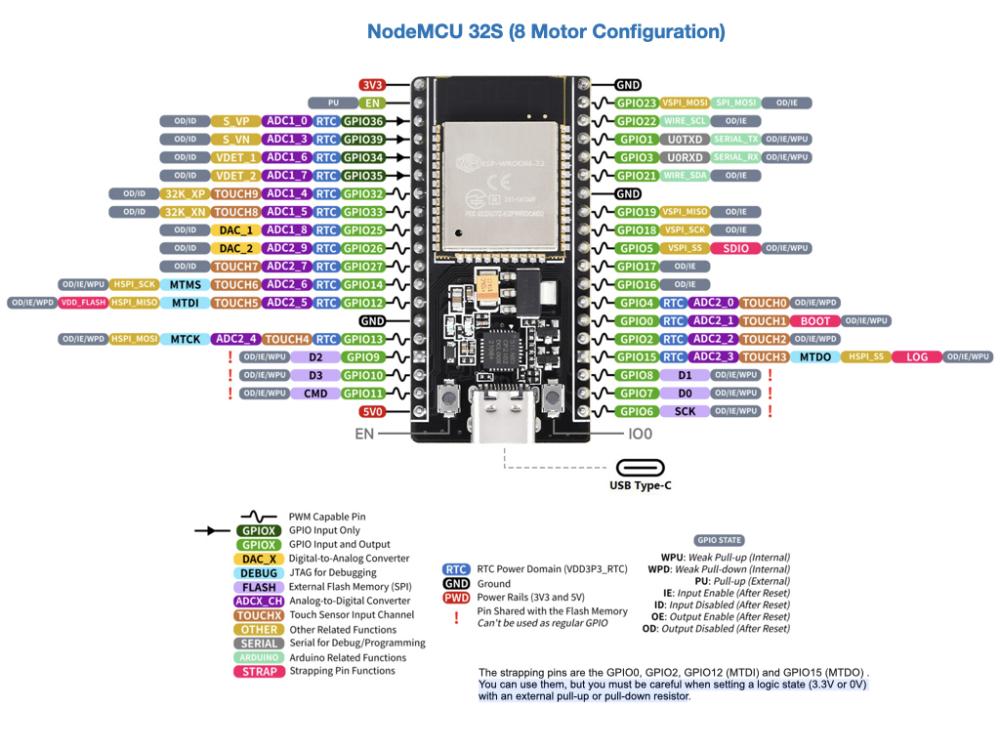
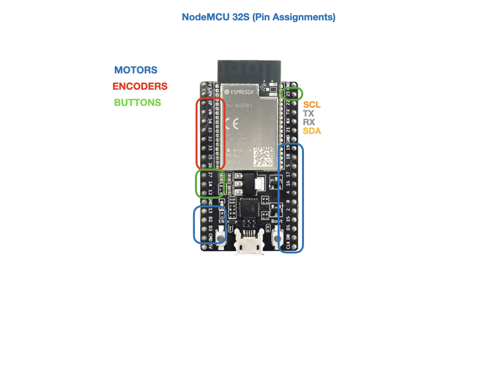

# DCMotor Driver for ESP32
Purpose of this project...

## Pinout

## Motors
The buffer for motors is int8, so only values of 128 to -128 is possible.  For the most part we'll only use -100 to 100.

## Polulu Encoders
Using both interrupts gives 12 ticks per/revolution.  A single interrupt give only 6 ticks per/revolution.

## CANOpen

- [ESP32 implementation](https://github.com/thaanstad/ESP32_CanOpenNode/tree/main) Arduino 

- Based on [CanOpenNode](https://github.com/CANopenNode/CANopenNode)

- [Electronic Data Sheet (EDS) Editor](https://github.com/CANopenNode/CANopenEditor)